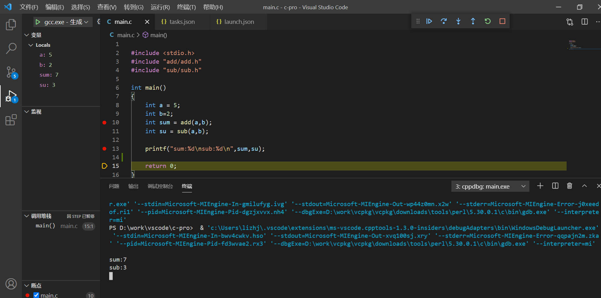

# use-vscode-writen-c

#### 1.编写源码文件：

```c
#include <stdio.h>
#include "add/add.h"
#include "sub/sub.h"

int main()
{
    int a = 5;
    int b=2;
    int sum = add(a,b);
    int su = sub(a,b);
    
    printf("sum:%d\nsub:%d\n",sum,su);
    
    return 0;
}
```


### 2.选择配置：


3.task

```json
{
    "tasks": [
        {
            "type": "cppbuild",
            "label": "C/C++: gcc.exe 生成活动文件",
            "command": "D:/work/vcpkg/vcpkg/downloads/tools/perl/5.30.0.1/c/bin/gcc.exe",
            "args": [
                "-g",
                "${fileDirname}\\add\\*",
                "${fileDirname}\\sub\\*",
                "${file}",
                "-o",
                "${fileDirname}\\${fileBasenameNoExtension}.exe"
            ],
            "options": {
                "cwd": "D:/work/vcpkg/vcpkg/downloads/tools/perl/5.30.0.1/c/bin"
            },
            "problemMatcher": [
                "$gcc"
            ],
            "group": {
                "kind": "build",
                "isDefault": true
            },
            "detail": "调试器生成的任务。"
        }
    ],
    "version": "2.0.0"
}
```





仅供学习和参考.